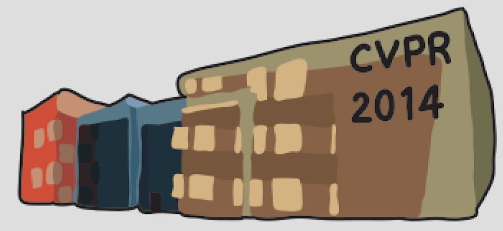

# Web_Search_Application

This project aims to build an efficient web search application for CVPR papers between 2014-2018.

## Computer Vision and Pattern Recognition
The Conference on Computer Vision and Pattern Recognition is an annual conference on computer vision and pattern recognition, by several measures regarded as the top conference in computer vision[1].

### [CVPR2018](http://cvpr2018.thecvf.com/)
 

### [CVPR2017](http://cvpr2017.thecvf.com)
 

### [CVPR2016](http://cvpr2016.thecvf.com)
 

### [CVPR2015](http://cvpr2015.thecvf.com)
 

### [CVPR2014](http://cvpr2014.thecvf.com)
 

## Reference:
[1] https://en.wikipedia.org/wiki/Conference_on_Computer_Vision_and_Pattern_Recognition
